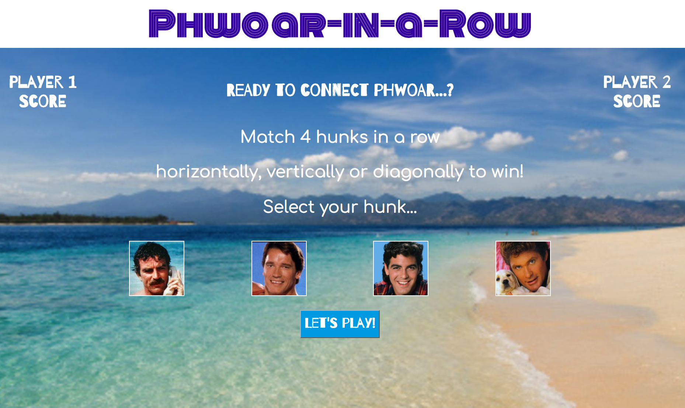
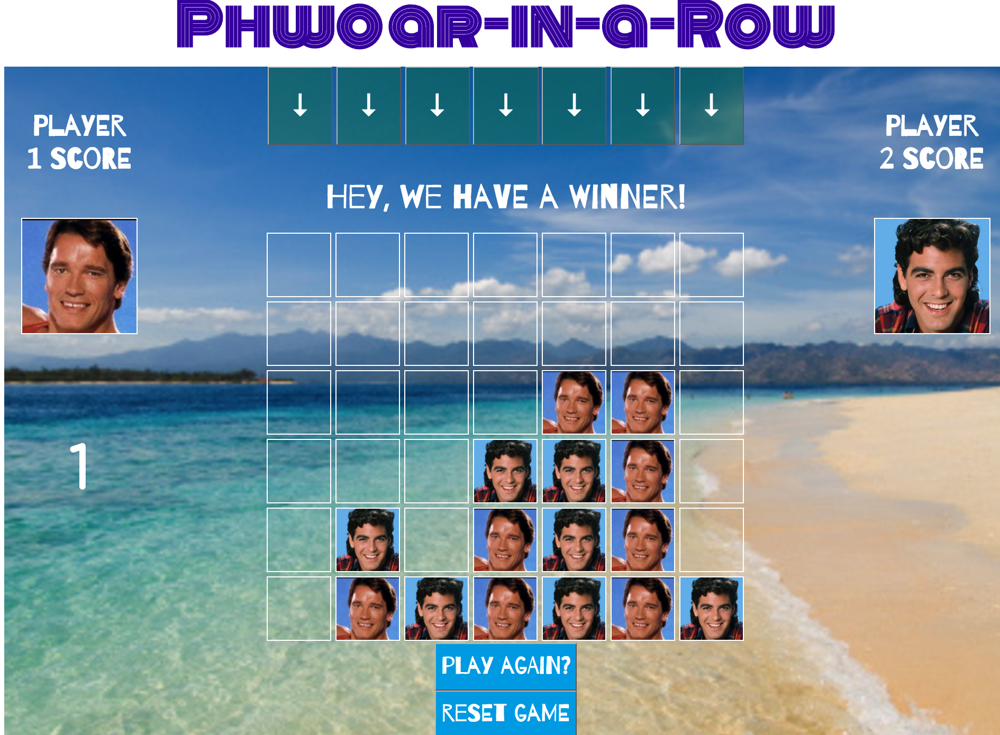
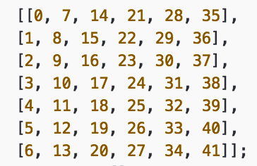
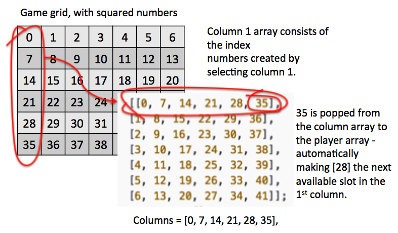

# Connect Phwoar

###GA WDI London - Project 1

#### Based on the popular Connect Four (4-in-a-row) game !

This game is a straight forward version of the original game, with a twist.  
It allows 2 players to play against eachother.

#####[Play Connect Phwoar!](https://safe-spire-58181.herokuapp.com/)

The welcome screen allows each player to select their token for the game. Hovering over a 'hunk' will play music!

The game grid sets out brief instructions then each player takes a turn by clicking the arrow above the column they want to select.
At the end of a game, the scores update for each player. A brief winners song plays.

#####Game Rules

1. Select your token piece.
2. Select the column you want to play your token by clicking on the arrow directly above it.  The token drops to the next available slot.
3. Take it in turns to play your token.
4. The first player to get 4 tokens in a line, vertically, horizontally or diagonally is the winner.

####Approach / How It Works

The 7x6 slot grid consists of 7 arrays, each of which denotes a column in the game.

When a player selects the column they wish to 'drop' their token, the last index for that column is popped from the column array and added to the players array.

As the player can only ever select a slot on the last available row of a column in the real world, the .pop command is perfect for performing this function.

After each turn, the players array is checked against the win conditions (of which there are 78 possibilities on a 7x6 grid).  It checks for a win by:

1. searching for win arrays which contain some of the players numbers 
2. of those arrays, searching for any in which all of the indices in the win array are present in the players array
3. if present, a win is announced
4. if not, the other player takes their turn and play contnues.

Once a winner is announced there is the option to:

1. play further games - the scores continue to tally, or 
2. reset the game, taking it back to the welcome page and resetting all scores and player variables.

Minimal sound is included. Audio is triggered by:

1. hovering over a player when selecting a token image to use and,
2. when a winner is announced.

####The Build

* HTML 5, CSS, jQuery and Javascript were used to create this game. 
* The Google Web Fonts 'Barrio', 'Monoton' and 'Comfortaa' have been used to style the game.

#### Problems & Challenges

The greatest challenges were:

1. designing the logic for the grid, so that a location could be identified and logged when a 'slot' was selected (in a methodical and efficient way)
2. ensuring that the player placed their token according to the 'rules of gravity' - ie the lowest available 'slot' in a column
3. ensuring occupied 'slots' could not be re-used again during current play
4. logging the progress for two players and storing the information in a way that could be easily re-used to check for a winner
5. capturing all win conditions

Once the logic for the grid was identified, all of these challenges were resolved quickly.  The most efficient way is to transpose 6 'rows' of arrays, each with 7 columns, across the grid.
This provided 41 indices, mapped against each available slot.

This resolved points 1-4 by providing:

1. a unique identifier for each slot. ie array and index
2. by using the .pop functionality, only the last number of the array (the lowest available slot of a column) was available to use (place a token)
3. .pop removed the index from the column array so that it could not be re-used
4. it also added it to the players array to build the set of token locations by which to check against the win conditions.
5. by having a grid, mapped with the arrays, the win conditions could be quickly identified and outlined

 

